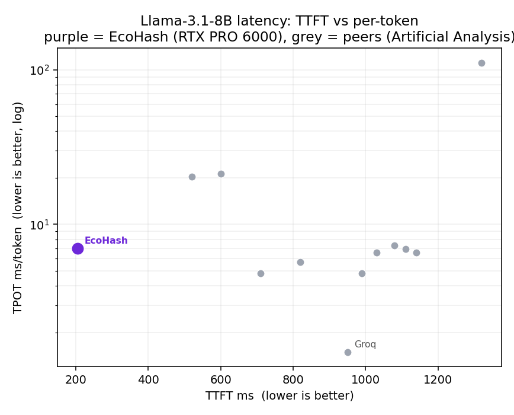
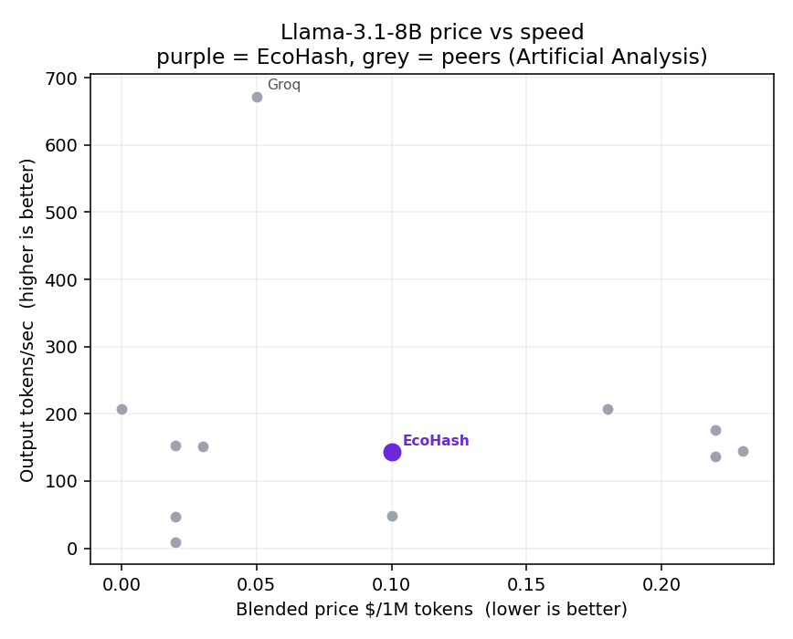

<p align="center">
  <a href="https://ecohash.com"></a>
</p>

<p align="center">
  
  <a href="https://docs.ecohash.com"></a>
  <a href="https://x.com/ecohashdev"></a>
  <a href="https://huggingface.co/ecohash-ai"></a>
</p>

# EcoHash Benchmarks

Open performance benchmarks for the open models served on EcoHash, an OpenAI-compatible inference API. All EcoHash numbers are measured on a single NVIDIA RTX PRO 6000 (Blackwell, 96 GB).

<p align="center">
  
  
</p>

## Methodology

The same open model gives different numbers depending on who serves it and how it is measured. Every table lists a **Source** column, and **EcoHash rows (in bold) are our own measurements** on a single RTX PRO 6000, end-to-end through `https://api.ecohash.com/v1`.

- **Speech** (2026-07): STT reports WER on LibriSpeech test-clean and RTFx as peak aggregate throughput under concurrency; TTS reports TTFA (time to first audio). Audio metrics include network.
- **Image** (2026-07): 1024×1024, each model at its design step count; latency per image, time per step, and images per minute.
- **LLM** (2026-07-08): each model is driven from 1 to 256 concurrent requests until p95 latency crosses a per-size SLO. We report TTFT (time to first token, p95), TPOT (time per output token), single-stream tokens/sec (1000/TPOT), and peak output throughput under concurrency.
- **Open ASR Leaderboard (A100)**: WER (English 8-dataset average) and RTFx from the [HF Open ASR Leaderboard](https://huggingface.co/spaces/hf-audio/open_asr_leaderboard), all models on one A100-80GB, batch 64. That RTFx is A100 throughput, not our hardware.

> Numbers from different sources are not directly comparable. WER on LibriSpeech test-clean is easier than the leaderboard's 8-dataset average, so a lower EcoHash WER does not mean the model beats its leaderboard row. Compare within the same Source column. Prices are per-provider and indicative.

## Speech-to-text

**Bold = measured by EcoHash.** RTFx here is peak aggregate throughput under concurrency.

| Model | Source | WER % ↓ | RTFx ↑ | Price |
|---|---|---|---|---|
| **qwen3-asr-1-7b** | **EcoHash (end-to-end)** | **3.28** | **360** | **input $0.05/1M tok** |
| **whisper-large-v3** | **EcoHash (end-to-end)** | **3.64** | **45** | **$0.006/min** |
| **whisper-large-v3-turbo** | **EcoHash (end-to-end)** | **4.37** | **59** | **$0.006/min** |
| **fun-asr-nano** | **EcoHash (end-to-end)** | **3.83** | **21** | **input $0.05/1M tok** |
| CohereLabs/cohere-transcribe-03-2026 | Leaderboard (A100) | 5.42 | 525 | - |
| ibm-granite/granite-4.0-1b-speech | Leaderboard (A100) | 5.52 | 280 | - |
| nvidia/canary-qwen-2.5b | Leaderboard (A100) | 5.63 | 418 | $0.00074/min (Replicate) |
| ibm-granite/granite-speech-3.3-8b | Leaderboard (A100) | 5.74 | 145 | - |
| Qwen/Qwen3-ASR-1.7B | Leaderboard (A100) | 5.76 | 148 | - |
| ibm-granite/granite-speech-3.3-2b | Leaderboard (A100) | 6.00 | 271 | - |
| microsoft/Phi-4-multimodal-instruct | Leaderboard (A100) | 6.02 | 151 | - |
| nvidia/parakeet-tdt-0.6b-v2 | Leaderboard (A100) | 6.05 | 3386 | - |
| nvidia/parakeet-tdt-0.6b-v3 | Leaderboard (A100) | 6.32 | 3333 | $0.0015/min (Together) |
| nvidia/canary-1b-flash | Leaderboard (A100) | 6.35 | 1046 | - |
| kyutai/stt-2.6b-en | Leaderboard (A100) | 6.40 | 88 | - |
| Qwen/Qwen3-ASR-0.6B | Leaderboard (A100) | 6.42 | 166 | - |
| mistralai/Voxtral-Small-24B-2507 | Leaderboard (A100) | 6.62 | 54 | $0.004/min (Mistral) |
| nvidia/parakeet-tdt-1.1b | Leaderboard (A100) | 7.02 | 2391 | - |
| mistralai/Voxtral-Mini-3B-2507 | Leaderboard (A100) | 7.05 | 110 | $0.001/min (DeepInfra) |
| nvidia/parakeet-ctc-1.1b | Leaderboard (A100) | 7.40 | 2729 | - |
| openai/whisper-large-v3 | Leaderboard (A100) | 7.44 | 146 | from $0.00045/min |
| nvidia/parakeet-tdt_ctc-110m | Leaderboard (A100) | 7.49 | 5345 | - |
| distil-whisper/distil-large-v3 | Leaderboard (A100) | 7.52 | 214 | - |
| openai/whisper-large-v3-turbo | Leaderboard (A100) | 7.83 | 200 | $0.003/min (OpenAI 4o-mini) |
| usefulsensors/moonshine-streaming-small | Leaderboard (A100) | 7.84 | 566 | - |
| usefulsensors/moonshine-base | Leaderboard (A100) | 9.99 | 566 | - |

> WER is not comparable across sources. EcoHash rows are measured on LibriSpeech test-clean (the easiest English set) with simple normalization; leaderboard rows are the 8-dataset average, which includes much harder audio. Read WER only within the same Source column.

Full data: [speech/stt.csv](speech/stt.csv).

## Text-to-speech

**Bold = measured by EcoHash.** There is no unified TTS speed leaderboard, so open-model TTFA is measured where available, otherwise vendor-claimed.

| Model | Source | TTFA | Streaming | Price |
|---|---|---|---|---|
| **kokoro-82m** | **EcoHash (end-to-end)** | **120 ms** | **yes** | **$1/1M** |
| **qwen3-tts** | **EcoHash (end-to-end)** | **2621 ms** | **yes** | **$2/1M** |
| Kokoro-82M | Open model (hexgrad) | ~325 ms (measured) | no | $0.62/1M (DeepInfra) |
| Chatterbox-0.5B | Open model (Resemble) | ~472 ms (measured) | yes | - |
| MeloTTS | Open model (MyShell) | non-streaming | no | - |
| Orpheus-3B | Open model (Canopy) | ~200 ms (claimed) | yes | $15/1M (Together) |
| CosyVoice2-0.5B | Open model (Alibaba) | ~150 ms (claimed) | yes | $7.15/1M (SiliconFlow) |
| Qwen3-TTS | Open model (Alibaba) | 97 ms (claimed) | yes | ~CNY 80/1M (DashScope) |
| Parler-TTS-large | Open model (Hugging Face) | <500 ms (claimed) | yes | - |

Full data: [speech/tts.csv](speech/tts.csv).

## Image generation

Measured on one RTX PRO 6000, end-to-end, 1024×1024, 2026-07. Each model runs at its design step count.

| Model | Params | Steps | Latency / image | Time / step | Images / min | Price / image |
|---|---|---|---|---|---|---|
| flux2-klein | 9B | 4 | 1.2 s | 0.29 s | 52 | $0.02 |
| z-image-turbo | 6B | 8 | 3.2 s | 0.40 s | 20 | $0.01 |
| qwen-image | 20B | 50 | 13.4 s | 0.27 s | 4.6 | $0.03 |

The three models run at similar time per step (0.27 to 0.40 s); total latency scales with the steps each model needs, which is why the 4-step and 8-step models finish fastest.

Same prompt across the three models: "a red apple on a weathered wooden table, soft window light, photorealistic".

<p align="center">
  
  
  
</p>

<p align="center"><sub>z-image-turbo (8 steps) · flux2-klein (4 steps) · qwen-image (50 steps)</sub></p>

Full data: [image/image.csv](image/image.csv).

## Large language models

Measured on one RTX PRO 6000, end-to-end, 2026-07-08. Single-stream tokens/sec is what one user's request sees.

| Model | Params | TTFT p95 | TPOT | Single-stream tok/s | Price in / out (per 1M) |
|---|---|---|---|---|---|
| llama-3.1-8b-instruct | 8B | 205 ms | 7 ms | ~143 | $0.10 / $0.10 |
| gpt-oss-20b | 20B MoE | 170 ms | 8 ms | ~125 | $0.05 / $0.18 |
| qwen2.5-7b-instruct | 7B | 257 ms | 10 ms | ~100 | $0.20 / $0.20 |
| gemma-4-31b-it | 31B | 191 ms | 27 ms | ~37 | $0.50 / $0.50 |
| qwen3-coder-30b-a3b-instruct | 30B MoE (3B active) | 30 ms | 9 ms | ~111 | $0.10 / $0.30 |

Peak output throughput under concurrency reaches about 11,500 tok/s on `llama-3.1-8b-instruct` and 8,900 tok/s on `gpt-oss-20b`. With 8k-token prompts, prefill throughput reaches roughly 170k to 220k tok/s, which makes long-context and RAG workloads the most cost-effective use of the card.

Same model, different providers. These compare `llama-3.1-8b-instruct` across providers, EcoHash (purple) against public numbers from Artificial Analysis (grey). EcoHash has the lowest time to first token in the field. On price and per-token speed it sits in the GPU pack, and it serves the model at full BF16 precision where many providers default to FP8.

<p align="center">
  
  
</p>

Full data: [llm/llm.csv](llm/llm.csv).

## Reproduce

The speech numbers use the runner in this repo:

```bash
pip install openai jiwer datasets soundfile numpy requests
export ECOHASH_API_KEY=eco_...   # create one at console.ecohash.com
python speech/benchmark.py --stt-n 50 --tts-n 8
```

LLM and image numbers were measured with an EcoHash load-test harness (concurrency sweep against the API); the methodology for each is described in its section above. Leaderboard numbers come from the [HF Open ASR Leaderboard](https://huggingface.co/spaces/hf-audio/open_asr_leaderboard), and the LLM peer numbers come from [Artificial Analysis](https://artificialanalysis.ai).

## License

MIT, see [LICENSE](LICENSE). Data may be reused with attribution.
