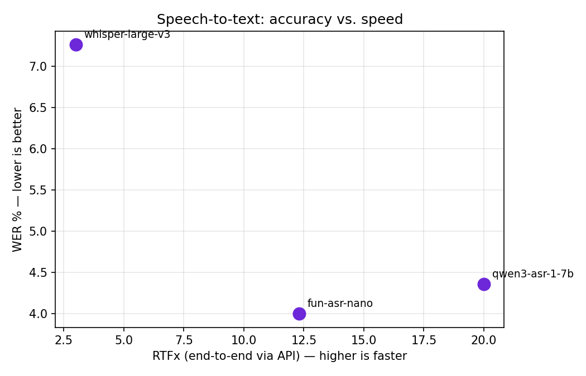
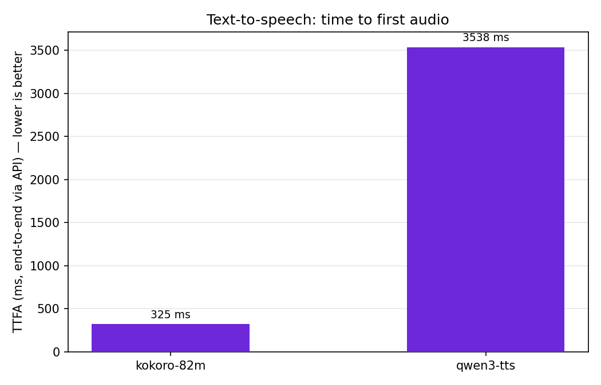

<p align="center">
  
</p>

<p align="center">
  <a href="https://console.ecohash.com?utm_source=github">Platform</a> •
  <a href="https://docs.ecohash.com">Docs</a> •
  <a href="https://ecohash.com">Website</a>
</p>

# EcoHash Benchmarks

Open, reproducible performance benchmarks for the open models served on EcoHash — an OpenAI-compatible inference API.

<p align="center">
  
  
  
</p>

<p align="center">
  
  
</p>

## Methodology

All numbers are measured **client-side, end-to-end through the EcoHash API** (`https://api.ecohash.com/v1`), so they include network and queueing — they reflect what a caller actually experiences, not pure-GPU throughput. Endpoints ran on **NVIDIA RTX PRO 6000** at measurement time.

- **STT** — word error rate (WER) with [jiwer](https://github.com/jitsi/jiwer) on LibriSpeech (clean, English) using simple text normalization; **RTFx** = audio duration ÷ latency (higher is faster).
- **TTS** — **TTFA** = time to first audio byte (streaming request); **RTF** = total time ÷ audio duration (RTF < 1 is faster than real time).
- Warmup runs + median across samples to suppress cold starts.
- Measured **2026-06-23** — STT: 50 clips per model; TTS: 8 sentences per model.

> **Status / caveats.** RTFx is an **end-to-end** figure (includes network), not pure-GPU throughput; a GPU-only throughput rerun with more models is planned. WER uses a simple normalizer for cross-model comparison and is **not directly comparable** to official leaderboards.

## Speech — transcription (STT)

| Model | WER % ↓ | RTFx (end-to-end) ↑ |
|---|---|---|
| `whisper-large-v3` | 7.26 | 3.0 |
| `qwen3-asr-1-7b` | 4.36 | 20.0 |
| `fun-asr-nano` | 4.00 | 12.3 |

Full data: [speech/stt.csv](speech/stt.csv).

## Speech — synthesis (TTS)

| Model | TTFA (end-to-end) ↓ | RTF ↓ |
|---|---|---|
| `kokoro-82m` | 325 ms | 0.077 |
| `qwen3-tts` | 3538 ms | 0.593 |

Full data: [speech/tts.csv](speech/tts.csv).

## Reproduce

```bash
pip install openai jiwer datasets soundfile numpy requests matplotlib
export ECOHASH_API_KEY=eco_...   # create one at console.ecohash.com

python speech/benchmark.py --stt-n 50 --tts-n 8   # measure
python speech/plot.py                             # regenerate the charts
```

## License

MIT — see [LICENSE](LICENSE). Data may be reused with attribution.
