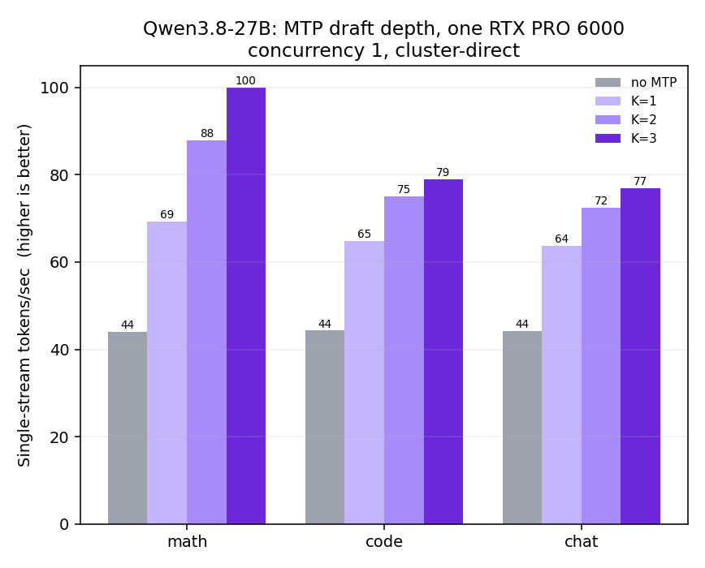
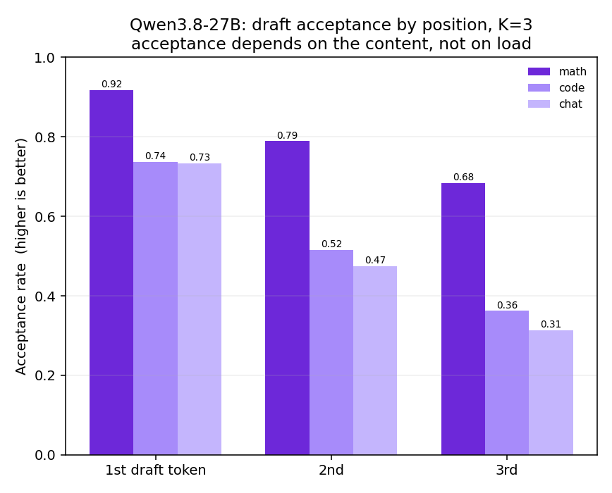
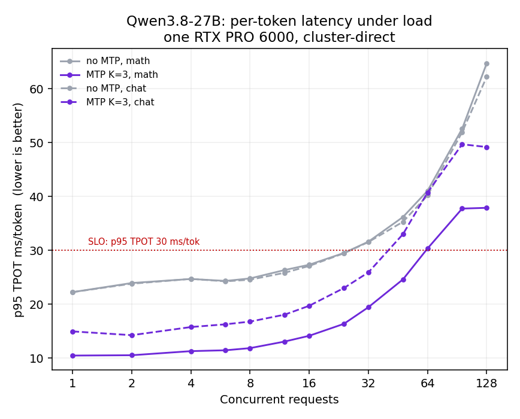
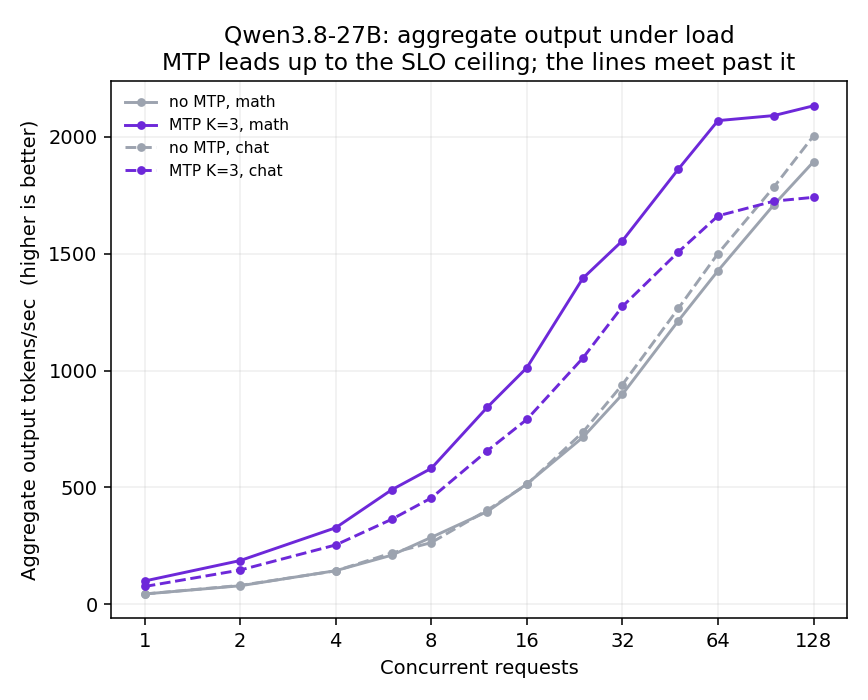

# Qwen3.8-27B with MTP speculative decoding, on one RTX PRO 6000

Qwen3.8-27B ships a multi-token-prediction (MTP) draft head inside the checkpoint. Turning
it on in vLLM is one flag. On a single RTX PRO 6000 Blackwell Server Edition it took
per-token latency from 22 ms to 13 ms and doubled the concurrency the card sustains inside
the same latency budget.

| | No MTP | MTP, K=3 | |
|---|---|---|---|
| TTFT p95, concurrency 1 | 198 ms | 179 ms | |
| TPOT, concurrency 1 | 22 ms | 13 ms | 1.7x |
| Single-stream tok/s | 43 | 78 | 1.8x |
| Concurrency inside the SLO | 32 | 64 | 2.0x |
| Output tok/s at that ceiling | 999.9 | 1954.0 | 1.96x |
| Peak output tok/s | 1,284.8 | 2,254.7 | 1.76x |
| Weights + non-torch | 29.34 GiB | 29.94 GiB | +0.60 GiB |
| KV cache | 767,317 tok | 592,164 tok | -23% |

Measured 2026-08-19. Every number below traces to the sweep files listed at the end.

## Setup

| | |
|---|---|
| GPU | 1x NVIDIA RTX PRO 6000 Blackwell Server Edition, 96 GB, driver 580.105.08, CUDA 13.0 |
| Engine | vLLM 0.27.1, V1 engine, CUDA graphs, `enforce_eager=False` |
| Model | Qwen3.8-27B, FP8 checkpoint (e4m3), 64 layers, hidden 5120 |
| Draft head | Ships with the checkpoint: `mtp_num_hidden_layers=1`, 22 `mtp.*` tensors, 0.44 GiB, no dedicated embeddings |
| Serving | `--max-model-len 32768 --max-num-seqs 128 --enable-prefix-caching`, one replica |
| The flag | `--speculative-config={"method":"mtp","num_speculative_tokens":K}` |
| SLO | medium tier: p95 TTFT <= 1500 ms, p95 TPOT <= 30 ms/tok |

Nothing else differs between the two arms. The baseline is the same deployment with the
flag removed.

## Method

Three workloads, 20 fixed prompts each: GSM8K-style word problems (`math`), HumanEval-style
function tasks (`code`), and MT-Bench-style open questions (`chat`). `max_tokens=150`,
`temperature=0.5`. Concurrency ramps 1, 2, 4, 6, 8, 12, 16, 24, 32, 48, 64, 96, 128 with
`max(24, 3x concurrency)` samples per level and 2 warm-up requests discarded. Load arrives
from a fixed-size thread pool that keeps the target concurrency in flight; sending a batch
and waiting for it to drain leaves the GPU idle between batches and makes TPOT look about
30% better than it is.

Two things are easy to get wrong here:

**TPOT must be divided by generated tokens, not by SSE chunks.** Without speculative
decoding the two are the same, one chunk per token. With it, one forward emits several
accepted tokens and vLLM packs them into a single chunk, so a chunk-based TPOT reads about
`acceptance_length` too high. That mistake is what first made this configuration look like
a regression.

**The autoscaler has to be frozen.** The deployment scales on queue depth, so a concurrency
ramp will scale it out and the result stops being a single-card number. It was pinned to one
replica for the whole run.

The load generator ran on a different node from the model. Two paths are reported and kept
separate: cluster-direct to the model service, and the full path through the regional
gateway with `capacity_test.py`, the same tool used for the other models in this repo.

## Choosing K

K is the draft depth: how many tokens the draft head proposes before the target model
verifies them. Deeper drafts win more per step but get rejected more often.



| Config | math tok/s | code tok/s | chat tok/s | Acceptance length (math / code / chat) |
|---|---|---|---|---|
| No MTP | 44.1 | 44.3 | 44.2 | n/a |
| K=1 | 69.3 | 64.9 | 63.7 | 1.91 / 1.78 / 1.73 |
| K=2 | 87.9 | 75.1 | 72.5 | 2.69 / 2.28 / 2.18 |
| K=3 | 99.9 | 78.9 | 76.9 | 3.39 / 2.61 / 2.52 |

K=3 wins on all three workloads, so that is what runs in production. Returns are already
flattening on `chat`, where K=2 to K=3 buys 6%.

vLLM warns that `num_speculative_tokens > 1` runs the same MTP layer several times per step
and that acceptance drops as a result. The per-position numbers below show it happening.

## Acceptance depends on the content



At K=3 the first draft token is accepted 92% of the time on math and 73% on chat, and by the
third position that gap has widened to 68% against 31%. Acceptance was stable across the
whole concurrency range (math 3.34 to 3.42, chat 2.45 to 2.52), so it is a property of the
text being generated, not of how busy the card is.

This is the whole reason the speedup is not one number. Predictable, low-entropy output
drafts well. Open-ended prose does not.

## Under concurrency



The SLO ceiling is where the p95 TPOT line crosses 30 ms. Without MTP that happens between
24 and 32 concurrent on both workloads. With MTP it moves to 48 on `math` and 32 on `chat`,
and the gateway measurement below reaches 64 on a mixed prompt pool.



The two arms converge past the ceiling. At 96 and 128 concurrent the SLO is already broken
by a wide margin in both arms, and on `chat` the MTP arm is no longer ahead: the card is
compute-bound by then, so the extra verification work stops paying for itself. That region
is outside the operating range, but the sweep ran through it and the numbers are below.

Full sweep, both arms, both workloads. Bold marks the last level inside the SLO.

| Concurrency | Load | No MTP TPOT p95 | No MTP tok/s | MTP TPOT p95 | MTP tok/s | Speedup | Acceptance length |
|---|---|---|---|---|---|---|---|
| 1 | math | 22.25 ms | 44.1 | 10.48 ms | 99.7 | 2.26x | 3.34 |
| 2 | math | 23.94 ms | 79.3 | 10.54 ms | 187.2 | 2.36x | 3.34 |
| 4 | math | 24.69 ms | 143.9 | 11.30 ms | 327.6 | 2.28x | 3.36 |
| 6 | math | 24.33 ms | 210.1 | 11.46 ms | 489.8 | 2.33x | 3.39 |
| 8 | math | 24.79 ms | 286.4 | 11.86 ms | 581.6 | 2.03x | 3.35 |
| 12 | math | 26.35 ms | 396.6 | 13.08 ms | 842.7 | 2.12x | 3.37 |
| 16 | math | 27.33 ms | 515.1 | 14.15 ms | 1012.4 | 1.97x | 3.38 |
| **24** | math | **29.51 ms** | **714.0** | 16.36 ms | 1394.5 | 1.95x | 3.38 |
| 32 | math | 31.61 ms | 898.5 | 19.45 ms | 1555.5 | 1.73x | 3.35 |
| **48** | math | 36.19 ms | 1213.0 | **24.62 ms** | **1861.7** | 1.53x | 3.36 |
| 64 | math | 41.05 ms | 1427.2 | 30.35 ms | 2069.5 | 1.45x | 3.38 |
| 96 | math | 52.57 ms | 1709.6 | 37.75 ms | 2091.1 | 1.22x | 3.37 |
| 128 | math | 64.70 ms | 1893.6 | 37.89 ms | 2132.9 | 1.13x | 3.36 |
| 1 | chat | 22.25 ms | 44.1 | 14.96 ms | 76.2 | 1.73x | 2.48 |
| 2 | chat | 23.81 ms | 80.8 | 14.26 ms | 146.6 | 1.81x | 2.47 |
| 4 | chat | 24.70 ms | 143.2 | 15.77 ms | 254.0 | 1.77x | 2.48 |
| 6 | chat | 24.25 ms | 219.5 | 16.28 ms | 363.6 | 1.66x | 2.45 |
| 8 | chat | 24.55 ms | 264.0 | 16.78 ms | 455.0 | 1.72x | 2.45 |
| 12 | chat | 25.84 ms | 402.7 | 18.07 ms | 656.5 | 1.63x | 2.48 |
| 16 | chat | 27.11 ms | 512.7 | 19.72 ms | 791.1 | 1.54x | 2.52 |
| **24** | chat | **29.45 ms** | **736.0** | 23.00 ms | 1053.2 | 1.43x | 2.48 |
| **32** | chat | 31.54 ms | 940.2 | **25.91 ms** | **1274.4** | 1.36x | 2.52 |
| 48 | chat | 35.30 ms | 1265.9 | 33.01 ms | 1507.4 | 1.19x | 2.49 |
| 64 | chat | 40.19 ms | 1500.8 | 40.74 ms | 1662.0 | 1.11x | 2.50 |
| 96 | chat | 51.94 ms | 1785.3 | 49.68 ms | 1724.9 | 0.97x | 2.49 |
| 128 | chat | 62.20 ms | 2004.4 | 49.17 ms | 1741.3 | 0.87x | 2.50 |

## Through the gateway

The numbers above are cluster-direct. This table is the full path a customer request takes,
measured with `capacity_test.py` against a mixed prompt pool.

| | No MTP | MTP, K=3 |
|---|---|---|
| Max concurrency inside the SLO | 32 | 64 |
| Output tok/s at that ceiling | 999.9 | 1954.0 |
| p95 TPOT at the ceiling | 29 ms | 30 ms |
| p95 TTFT at the ceiling | 465 ms | 955 ms |
| Requests/sec at the ceiling | 6.67 | 13.03 |
| Revenue per GPU-hour at the ceiling | $2.60 | $5.08 |
| Peak output tok/s | 1,284.8 at C=48 | 2,254.7 at C=96 |
| First level to break the SLO | C=48, TPOT 34 ms | C=96, TTFT 5779 ms |

Revenue is the tokens served at the ceiling priced at the published $0.30 in and $0.60 out
per 1M, which is what the same card earns from the same hardware once the flag is on.

One caveat on the MTP ceiling: C=64 sits right on the 30 ms line. Four repeats of the sweep
read 30, 30, 31 and 31 ms there, so the ceiling landed at 64 twice and 48 twice. The table
reports the better pair. Treat 64 as the top of a range, not a hard floor.

## What it costs

| | No MTP | MTP, K=3 |
|---|---|---|
| Weights + non-torch | 29.34 GiB | 29.94 GiB |
| KV cache | 53.8 GiB | 52.55 GiB |
| KV cache in tokens | 767,317 | 592,164 |
| Max concurrency at full 32k context | 23.42x | 18.07x |
| Engine init | 171 s | 166 s |

The draft head itself is small, 0.44 GiB, and it reuses the main embedding rather than
carrying its own. The visible cost is the KV cache: 23% fewer tokens, because the MTP block
brings an attention layer that needs cache of its own. At 48 to 64 concurrent short requests
that headroom is not the binding constraint. It would become one before pushing concurrency
much higher.

## Quality checks

Byte-for-byte comparison does not work as a losslessness test here, and the control run
shows why.

| Check | Result | |
|---|---|---|
| MTP vs MTP, same config, two runs, 12 greedy prompts | 12/12 identical | Greedy decoding is deterministic at a fixed config |
| MTP quiet vs MTP under background load, same config | 6/12 identical | Changing only the batch shape changes half the outputs |
| No MTP vs MTP K=3, 12 greedy prompts | 3/12 identical | Divergence is reasoning length and wording |
| Answer agreement, 9 prompts with one checkable answer | 9/9 | |
| Accuracy | 9/9 vs 9/9 | Both arms correct on all nine |

The second row is the control. Nothing about the configuration changed between those two
runs except how many other requests were in flight, and half the outputs still differ. So a
byte diff between the baseline and MTP arms measures batch shape, not correctness. What is
checkable is the answer, and the answers match.

One anomaly worth recording: in the run under background load, one of the twelve prompts
returned an empty completion with no error. It did not reproduce on a quiet re-run and the
cause was not tracked down.

## Limitations

- One model, one card, one engine version. Nothing here says how MTP behaves on a different
  GPU or a different vLLM release.
- The load generator sat on a separate node, but the model node is shared with other
  inference pods. Their GPUs were separate; CPU, PCIe and the chassis were not.
- 150 output tokens per request. Longer generations amortise TTFT differently.
- Quality checking is nine questions with known answers, not an evaluation suite. It rules
  out gross breakage, not a small quality shift.
- At 96 concurrent and above the engine admitted about 77 requests and queued the rest,
  where the baseline ran all 128 with an empty queue. That tracks the KV cache reduction,
  but the exact mechanism was not identified.

## Reproduce

Add one flag to the vLLM launch arguments:

```
--speculative-config={"method":"mtp","num_speculative_tokens":3}
```

Everything else stays the same. The deployment manifest is in
[ecolink-infra](https://gitlab.ecohash.com/ecohash/ecolink-infra), and the gateway path was
measured with `capacity_test.py` from the EcoLink repo, unmodified.

The model is served on EcoHash as `qwen3.8-27b` through an OpenAI-compatible API:

```bash
curl https://api.ecohash.com/v1/chat/completions \
  -H "Authorization: Bearer $ECOHASH_API_KEY" \
  -H "Content-Type: application/json" \
  -d '{"model":"qwen3.8-27b","messages":[{"role":"user","content":"Say hi"}]}'
```

## Data

| File | Contents |
|---|---|
| [qwen38-mtp-kvalues.csv](qwen38-mtp-kvalues.csv) | Single-stream throughput and acceptance length per K, per workload |
| [qwen38-mtp-acceptance.csv](qwen38-mtp-acceptance.csv) | Acceptance rate by draft position |
| [qwen38-mtp-concurrency.csv](qwen38-mtp-concurrency.csv) | Full concurrency sweep, both arms, both workloads |
| [qwen38-mtp-gateway.csv](qwen38-mtp-gateway.csv) | Gateway-path summary for both arms |
| [qwen38-providers.csv](qwen38-providers.csv) | Price and speed against other providers serving this model |

Charts regenerate from those CSVs with `python speech/plot.py`.

## License and sources

Data in this directory is EcoHash's own measurement, MIT licensed with the rest of the repo,
reusable with attribution. Qwen3.8-27B is Apache-2.0, released by the Qwen team at Alibaba
on 2026-08-14. Peer pricing and speed come from
[OpenRouter](https://openrouter.ai/qwen/qwen3.8-27b), read 2026-08.
