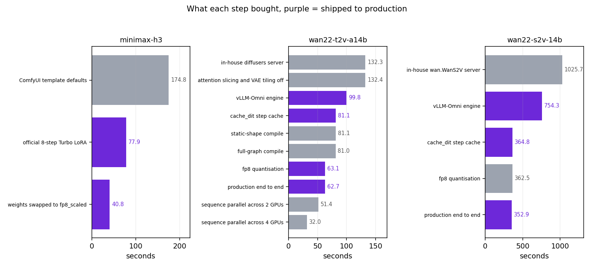
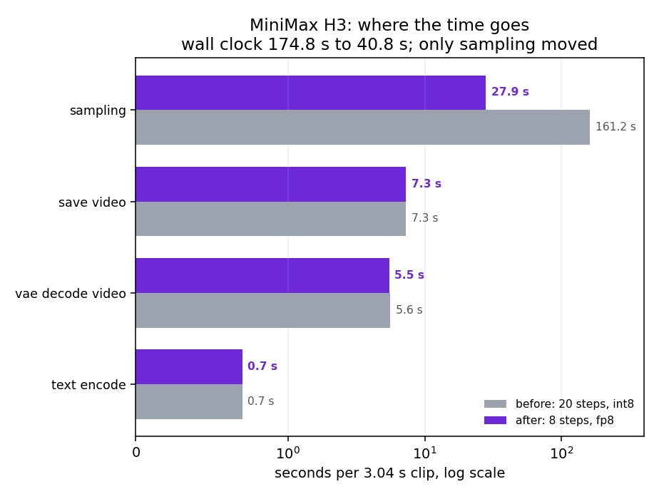
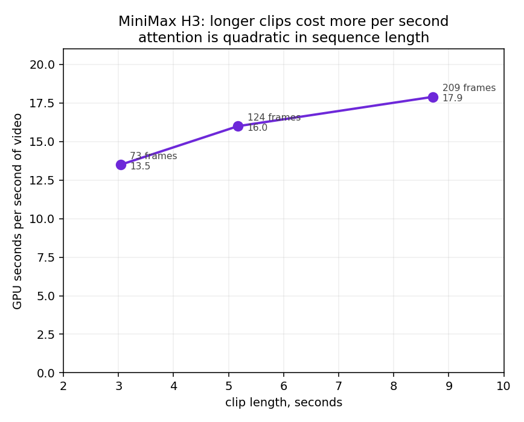

# MiniMax H3 and Wan2.2 video generation, on one RTX PRO 6000

Two self-hosted video models, five configurations, one card each. Generation time came
down by 2.1x to 5.9x depending on the model, with no weight conversion and no change to
the API contract.

| Model | Config | Before | After | Speedup |
|---|---|---|---|---|
| minimax-h3, text to video | 1344x768, 73 frames (3.04 s), seed 42 | 174.8 s | 40.8 s | **4.28x** |
| wan22-t2v-a14b, engine swap | 848x480, 49 frames, 20 steps, CFG 4.0 | 132.3 s | 62.7 s | **2.11x** |
| wan22-t2v-a14b, 4-step distilled | 848x480, 49 frames, 4 steps, CFG 1.0 | 62.7 s | 10.7 s | **5.86x** |
| wan22-s2v-14b, 720 tier | 832x1088, 77 frames, 20 steps, 1 segment | 1025.7 s | 352.9 s | **2.91x** |
| wan22-s2v-14b, 480 tier | 512x704, 77 frames, 20 steps, 1 segment | 307.1 s | 93.9 s | **3.27x** |

Wan2.2 measured 2026-08-10, the distilled t2v config and H3 on 2026-08-18. The two t2v
rows chain: the 4-step row's "before" is the previous row's "after".

  

The part worth reading is not the speedups. It is which knobs did nothing: three of the ten
things tried on Wan2.2 t2v returned zero, and fp8 quantisation that gave 1.5x on t2v gave
nothing at all on s2v.

## Hardware and setup

| | |
|---|---|
| GPU | 1x NVIDIA RTX PRO 6000 Blackwell Server Edition, 96 GB |
| Deployment | single card, single replica per model, one tenant per card |
| wan22-t2v-a14b, wan22-s2v-14b | dls region, vLLM-Omni engine plus a contract adapter |
| minimax-h3 | atl region, ComfyUI (`comfyui:v0.1.0` worker, `comfyui-editor:v0.1.1`) |
| Wan2.2 weights | the original official Wan2.2 checkpoints, no conversion |
| H3 weights | `Comfy-Org/MiniMax-H3`, `pruned_int8_convrot` before and `pruned_fp8_scaled` after, both 19.5 GiB |
| H3 LoRA | `minimax_h3_fl2v_turbo_8step_v1.0_comfyui_bf16`, 1.82 GiB, full rank |

The Wan2.2 work replaced an in-house single-file server with vLLM-Omni behind an adapter
that keeps the old `/v1/video/generations` contract byte for byte, so Service, HTTPRoute,
model catalogue and capacity tests were untouched. The H3 work changed neither the model
nor the container image: it swapped one build of the same Hugging Face repo for another and
attached the vendor's Turbo LoRA.

## How the numbers were taken

Generation time is wall clock from request to complete video. Server-side timers read 1 to
2 seconds lower, which is the mp4 mux plus base64 encode.

Fixed prompt, fixed seed, requests sent serially, median of three samples. vLLM-Omni
compiles transformer blocks lazily, so every configuration got one warm-up request that
was thrown away; without it the measurement is compilation rather than inference. For H3
the warm-up is a `steps=1` run, discarded, because loading 20 GB of weights takes about
100 seconds on its own.

The comparison deployment ran on the same GPU model against the same read-only PVC, at
`user-spot` priority so it could not preempt any production model. Production was not
affected during the runs.

Two parameters are easy to misread. **fps does not change generation time.** Diffusion
produces a fixed frame count and fps only sets playback speed: 49 frames is a 3.1 s clip at
fps 16 and an 8.2 s slow-motion clip at fps 6, for the same cost. And s2v's `width`/`height`
are an area budget rather than an output size; the real dimensions follow the reference
image's aspect ratio, so a request for 720x1280 against an 832x1104 reference returns
832x1088.

## What each step bought

  

Grey bars that match the length of the bar above them are the interesting ones.

### MiniMax H3

| Config | Time | Cumulative | Shipped |
|---|---|---|---|
| ComfyUI template defaults | 174.8 s | 1.00x | |
| plus official 8-step Turbo LoRA | 77.9 s | 2.24x | yes |
| plus weights swapped to fp8_scaled | 40.8 s | 4.28x | yes |

The 8-step LoRA takes the step count from 20 to 8 and the sampler to `euler`/`beta`.
Per-step cost did not move: 8.06 s before, 8.08 s after. The entire 2.24x is the twelve
steps not taken, and none of it is the LoRA being cheaper to evaluate.

The weight swap is where per-step cost changed, 8.08 s to 3.49 s, worth 1.91x by itself.
Same repo, same 19.5 GiB file size, no image rebuild, no CUDA change. `int8_convrot` was
the slower of the two builds on this card, and it is the one the bundled template ships
with.

Peak memory went the other way: 45.8 GiB on int8, 61.9 GiB on fp8, against 95.6 GiB on the
card. We did not chase the reason. On a single-tenant 96 GB card the memory was spare and
the speed was not, so the trade was easy, but that is a property of this deployment and not
a general result.

### Wan2.2 text to video

| Config | Time | Cumulative | Shipped |
|---|---|---|---|
| in-house diffusers server | 132.3 s | 1.00x | |
| attention slicing and VAE tiling off | 132.4 s | none | |
| vLLM-Omni engine | 99.8 s | 1.33x | yes |
| plus cache_dit step cache | 81.1 s | 1.63x | yes |
| plus static-shape compile | 81.1 s | none | |
| plus full-graph compile | 81.0 s | none | |
| plus fp8 quantisation | 63.1 s | 2.10x | yes |
| production end to end, adapter included | 62.7 s | 2.11x | yes |
| sequence parallel across 2 GPUs | 51.4 s | 2.57x | |
| sequence parallel across 4 GPUs | 32.0 s | 4.13x | |

The baseline is not a one-off: four historical production calls logged 131.6 to 132.0 s
before the re-measurement at 132.3 s.

fp8 here is the same official weights quantised online rather than a different checkpoint,
and it also took resident weights from 64.2 to 37.9 GiB.

A later change, on 2026-08-13, fused LightX2V's 4-step distillation LoRA into both experts.
That is the 10.7 s row in the headline table. A control run at the old parameters (20 steps,
CFG 4.0) came back at 66.4 s, level with the 2026-08-10 result, so the distillation LoRA
does not change per-step cost either. The 5.86x comes from being able to drop to 4 steps and
CFG 1.0, and the CFG half of that matters: distillation bakes guidance into the weights, so
CFG above 1.0 spends a whole unconditional forward pass for nothing.

### Wan2.2 speech to video

| Config | Time | Cumulative | Shipped |
|---|---|---|---|
| in-house wan.WanS2V server | 1025.7 s | 1.00x | |
| vLLM-Omni engine | 754.3 s | 1.36x | yes |
| plus cache_dit step cache | 364.8 s | 2.81x | yes |
| plus fp8 quantisation | 362.5 s | none | |
| production end to end, adapter included | 352.9 s | 2.91x | yes |

`cache_dit` is the largest single win anywhere in this work, 2.07x on s2v against 1.23x on
t2v. fp8, which was worth 1.29x on t2v, returned 0.6% here and left memory unchanged, which
says it is not reaching the s2v transformer at all.

The last row is not an engine change. The adapter trims the audio to the length actually
requested, which drops the extra half segment the engine would otherwise render.

## Where the time goes

  

| Stage | Before, 20 steps | After | Share after |
|---|---|---|---|
| sampling | 161.2 s | 27.9 s | 68% |
| save video | 7.3 s | 7.3 s | 18% |
| vae decode, video | 5.6 s | 5.5 s | 14% |
| text encode | 0.7 s | 0.7 s | <2% |
| **wall clock** | **174.8 s** | **40.8 s** | |

Sampling was the only stage this round touched, and after it shrank 5.8x the fixed work
became a third of the total. That is the ceiling on further sampling work: even free
sampling would only reach about 13 s.

`SaveVideo` is libx264 on the CPU. PyAV 18.1 inside the container can construct an
`h264_nvenc` encoder, but ComfyUI's `SaveVideo` node does not expose the codec, so using it
needs a patch or a custom node. The VAE decoder is a 36-layer ViT and was left alone. Text
encoding runs qwen3vl-32B but only prefills about 100 tokens with the weights already
resident, and on a repeated prompt it hits ComfyUI's node cache instead.

The four stage figures are medians across three prompts, so they sum to within a few tenths
of the wall clock rather than exactly.

## Clip length

Longer clips cost more per second of output, because attention is quadratic in sequence
length. Measured on H3 at 8 steps and fp8:

| Frames | Clip length | Time | GPU seconds per second of video |
|---|---|---|---|
| 73 | 3.04 s | 41.0 s | 13.5 |
| 124 | 5.17 s | 82.5 s | 16.0 |
| 209 | 8.71 s | 156.2 s | 17.9 |

  

2.86x the frames costs 3.78x the time. Frame counts have to land on H3's 17k+5 grid (73,
124, 175, 209, 362); anything else is rounded up.

## What did not work

| Tried | Model | Result | Why |
|---|---|---|---|
| attention slicing and VAE tiling off | t2v | 132.3 to 132.4 s | both trade compute for memory, and memory was never the limit |
| `--no-diffusion-compile-dynamic` | t2v | 81.1 to 81.1 s | the default regional compile already takes what is available |
| `--diffusion-compile-granularity=full` | t2v | 81.1 to 81.0 s | same |
| fp8 quantisation | s2v | 364.8 to 362.5 s, 0.6% | resident memory did not move either, so it is not reaching that model's transformer |

**The memory assumption was wrong.** Going in we expected the memory switches to help. The
GPU sits at 100% utilisation and 598 W against the power cap for the whole generation, so
compute was the limit and trading compute for memory could only ever cost time.

Sequence parallel does work, and we did not ship it. Four cards take t2v to 32.0 s, but
output per card falls from 1.63 to 1.03 relative to the single-card baseline, while four
independent single-card replicas emit a clip every 15.8 s, which is 2.03x the throughput.
Multi-GPU buys single-clip latency with aggregate throughput. Whether that trade is worth
making depends on whether one user is waiting or a batch is being produced, and here it is
the batch.

Steps and CFG were close to spent on the undistilled path. The vendor suggests 40 to 50
steps and we were already at 20. Dropping CFG saves about half but visibly costs prompt
adherence. The distillation LoRA changed that arithmetic by making 4 steps and CFG 1.0 the
intended operating point rather than a corner to be cut.

## Limitations

Quality has not been evaluated systematically. All that was done is a same-seed frame
comparison by eye, which showed no visible artefacts. `cache_dit` is a lossy technique by
construction, so anything running on it long term needs per-frame evaluation, and the H3
8-step distillation deserves the same.

The H3 numbers were taken on a worker started with `--enable-triton-backend`. Measured
separately, that flag is worth 3.7% of sampling time and 1.8% end to end, so it is inside
the rounding on these figures, but it was present.

For five days the `wan22-t2v` adapter still defaulted to 40 steps and CFG 4.0 after the
distillation LoRA went in, so any caller that did not pass parameters explicitly got about
130 s, slower than the 62.7 s the model did before distillation. Fixed on 2026-08-18 to 4
steps and CFG 1.0 and verified at 10.7 s for a parameterless call. Only the adapter
container was restarted, so the 65 GB of weights in vllm-omni stayed loaded.

The first call after any restart takes roughly twice the steady-state time. Transformer
blocks compile lazily and the first request pays for it. It is not a hang.

Peak memory on H3 fp8 is 16 GiB higher than int8 and we did not find out why.

## Operations

Rollback for the Wan2.2 models is `kubectl apply -f ~/wan22-rollback/<model>.deploy.yaml`;
both deployments and services are backed up. The cutover itself was zero downtime: a
same-spec test stack was warmed up, the Service pointed at it, production edited, then the
Service pointed back and the test stack deleted.

Production runs two containers per Wan2.2 model, the adapter on :8000 and vLLM-Omni on
:8001. vLLM-Omni only speaks its own request format, and the adapter keeps the older
`/v1/video/generations` contract unchanged, which is why nothing above it had to move.

Live flags are `cache_dit` plus fp8 on t2v, and `cache_dit` alone on s2v. None of the
ineffective flags were carried into production.

## Data

| File | Contents |
|---|---|
| [video.csv](video.csv) | The five configurations before and after, with clip length and price |
| [video-techniques.csv](video-techniques.csv) | Every step tried on all three models, including the ones that returned nothing |
| [h3-stage-breakdown.csv](h3-stage-breakdown.csv) | H3 per-stage timing, before and after |
| [h3-length-scaling.csv](h3-length-scaling.csv) | H3 clip length against cost per second of video |

Charts regenerate from those CSVs with `python video/plot.py`.

## License and sources

Data in this directory is EcoHash's own measurement, MIT licensed with the rest of the repo,
reusable with attribution. Wan2.2 is released by the Wan team at Alibaba; MiniMax H3 is
released by MiniMax, and the ComfyUI-format weights and the 8-step Turbo LoRA come from
[Comfy-Org/MiniMax-H3](https://huggingface.co/Comfy-Org/MiniMax-H3). The 4-step
distillation LoRA for Wan2.2 t2v is LightX2V's.
